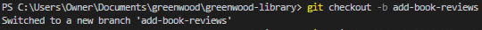

# Greenwood-library Website Project

## Table of Contents

- [Greenwood-library Website Project](#greenwood-library-website-project)
  - [Table of Contents](#table-of-contents)
  - [Project Overview](#project-overview)
    - [Key Objectives](#key-objectives)
  - [Setup](#setup)
    - [1. Create a Repository on GitHub](#1-create-a-repository-on-github)
    - [Command to clone the repository:](#command-to-clone-the-repository)
  - [Initial Repository Structure](#initial-repository-structure)
    - [2. Creating Initial HTML Files](#2-creating-initial-html-files)
    - [3. Adding Initial Content](#3-adding-initial-content)
    - [4. Stage, Commit and Push the initial files.](#4-stage-commit-and-push-the-initial-files)
  - [Morgan's Work: Adding Book Reviews](#morgans-work-adding-book-reviews)
    - [1. Creating a New Branch](#1-creating-a-new-branch)
    - [2. Adding Book Reviews Page](#2-adding-book-reviews-page)
    - [3. Committing and Pushing Changes](#3-committing-and-pushing-changes)
    - [4. Creating a Pull Request](#4-creating-a-pull-request)
    - [5. Merging the Pull Request](#5-merging-the-pull-request)
  - [Jamie's Work: Updating Events Page](#jamies-work-updating-events-page)
    - [1. Creating a New Branch](#1-creating-a-new-branch-1)
    - [2. Updating Events Page](#2-updating-events-page)
    - [3. Pulling Latest Changes](#3-pulling-latest-changes)
    - [4. Committing and Pushing Changes](#4-committing-and-pushing-changes)
    - [5. Creating a Pull Request](#5-creating-a-pull-request)
    - [6. Merging the Pull Request](#6-merging-the-pull-request)
  - [Git/GitHub Best Practices](#gitgithub-best-practices)
  - [Conclusion](#conclusion)

## Project Overview

The Greenwood Libaray Website Enhancement Project aims to improve the functionality, performance and features of the exsiting website by adding new features and updating content.
The primary objective of this project was for developers to work simultaneously while creating new features and updating content of the website.

### Key Objectives

- practice how to use Git workflows including cloning, branching, staging, commits, push and pull requests.
- Simulate a colaborative development workflow with two other developers.
- Enhancing the website's functionality and conytent.

## Setup

### 1. Create a Repository on GitHub

Start by creating a repository on GitHub named "greenwood-library".

STEPS:

1. Log into Github
2. Create a new repository
3. Initialize with a README.md file
4. Clone the repository to your local machine


### Command to clone the repository:

```
git clone https://github.com/ibidamola/greenwood-library.git
```


## Initial Repository Structure

### 2. Creating Initial HTML Files

in the main branch, i created the html files for eaach of the existing web pages.

Files created:

- home.html
- about.html
- events.html
- contact_us.html

Making use of VSCode


### 3. Adding Initial Content

Added placeholder content to each of the HTML files to simulate the existing codebase.


### 4. Stage, Commit and Push the initial files.

stage, commit anbd push the changes to the main branch.

Commands:

```
git add.
git commit -m "commit message"
git push origin main

OR

STAGE AND COMMIT TOGETHER:

git commit -a -m "stage commit message"

```


## Morgan's Work: Adding Book Reviews

### 1. Creating a New Branch

Create and switch to a new branch for Morgan's work.

Commands:

```bash
Copy

git checkout -b add-book-reviews
```



### 2. Adding Book Reviews Page

Created a new file book_reviews.html and add content.

### 3. Committing and Pushing Changes

Stage, commit, and push the changes to the new branch.

Commands:

```bash
Copy

git add book_reviews.html git commit -m "Add book reviews section" git push origin add-book-reviews
```


### 4. Creating a Pull Request

Created a pull request on GitHub to merge the add-book-reviews branch into main.


### 5. Merging the Pull Request

Review and merge the pull request on GitHub.


## Jamie's Work: Updating Events Page

### 1. Creating a New Branch

Create and switch to a new branch for Jamie's work.

Commands:

```bash
Copy

git checkout -b update-events
```


### 2. Updating Events Page

Updated the content in events.html with new background and text events.


### 3. Pulling Latest Changes

Before committing, pull the latest changes from the main branch to ensure code is up to date.

Commands:

```bash

Copy

git checkout main git pull origin main git checkout update-events git merge main
```


### 4. Committing and Pushing Changes

Stage, commit, and push the changes to the new branch.

Commands:

```bash

Copy

git add events.html git commit -m "Update events page with new community events" git push origin update-events
```


### 5. Creating a Pull Request

Create a pull request on GitHub to merge the update-events branch into main.

### 6. Merging the Pull Request

Review and merge the pull request on GitHub.


## Git/GitHub Best Practices

Throughout this project, several Git and development best practices were followed:

- Branch Management: Separate branches were created for each feature, avoiding corrupting the main branch.

- Descriptive Commit Messages: All commits used clear and descriptive messages to explain the changes made.

- Pull Before Push: The latest changes were pulled from the main branch before pushing new changes, reducing the risk of conflicts.

- Code Review: Pull requests were used to facilitate code review before merging changes into the main branch.

- Consistent File Naming: A consistent naming convention was used for HTML files (lowercase with underscores).

- Version Control: Git was used effectively to track changes and collaborate on the project.

## Conclusion

This project successfully enhanced the Greenwood Library website by adding a Book Reviews section and updating the Events page. The use of Git and GitHub facilitated efficient collaboration and version control throughout the development process.

The documentation provided here serves as a comprehensive guide for understanding the project structure, development process, and best practices followed.
